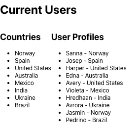
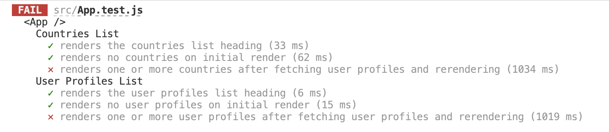

# React useEffect

You are a junior developer at a marketing firm called "Spark Digital." Your team is working on a project that will render a random set of users and provide the ability to filter them based on their country name. Each time a new random list of users is requested, the list of country locations will also need to be recreated. Several members of your team are currently working on building the React components to render the user profiles. You have been tasked with making the backend API call to fetch the data and render a basic list (ul > li) of unique country names.

- Use the `useEffect` hook to invoke a service call and set state with the result.
- Render a basic list of countries and user data from state.

---

### Preperation Steps
- Fork and clone [this](https://git.generalassemb.ly/SEI-Standard-Curriculum/M3L13-useEffect-useRef-wbp) repository
- Run `npm i`

### Step 1
- Import `useEffect` into `App.jsx`.
- Add the `useEffect` hook and configure it to run once on initial render. 
- Configure the `useEffect` hook to do the following:
    - make the API call using the `usersAPI.getUsers()` method
    - update the `userData` state variable with the returned data
- Next, you can work to derive a list of countries from state.  
    - Hint: `.reduce()`, or a combination of `.map()` and `.filter()`, will be helpful when trying to generate a new array from an extensive array of objects.
- Render a basic list of the countries and user data based on this graphic:

1. Confirm that the following failed tests in `App.test.js` pass successfully.

